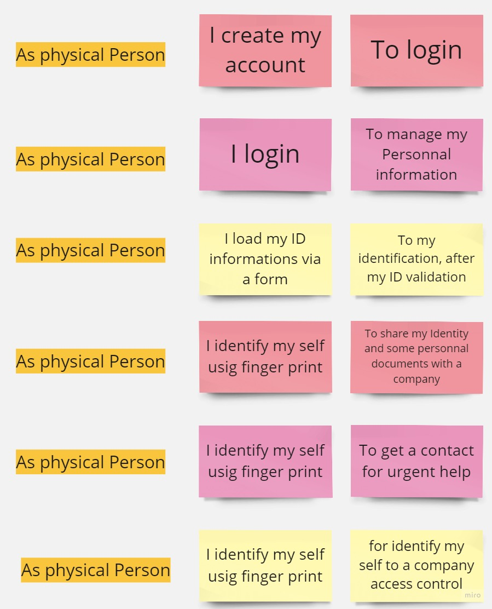

# DIGITAL ID CARD
## What is it?
E-IDCARD is an Open Source Project, where the aim is to built an API and Mobile Application opened to Gouvernment, Companies and an entities which requierd to Identifier Personne.
This proect solution is to resolve following problems:
###    For physical persons:
        - Loosing or Risque of Lossing of IDCARD: 
        - Forgetting of IDCARD
        - Some Times kindnaping/accidents happen without an notifications, and it difficult to get his members contacts
	The persons can move without hold necessarely his ID Card, and make trust between 2 parteners

###    For moral persons:
        - It good for a **gouvernment** security, it will be easy to detect a stranger to a country
        - some **companies** acces controls systems have dificulties to get un unknown identity

## Why should I make it?
It's an easy way to answer questions that your audience will likely have regarding how to install and use your project and also how to collaborate with you.

Who should make it?
Anyone could work on this project. For exemple: Backend developers, Frontend developers, Conceptor, UI/UX, Tester, Writer ...

## Application Features:

[Click to view miro page](https://miro.com/app/board/uXjVNSp_Mxo=/?share_link_id=880404467244)

